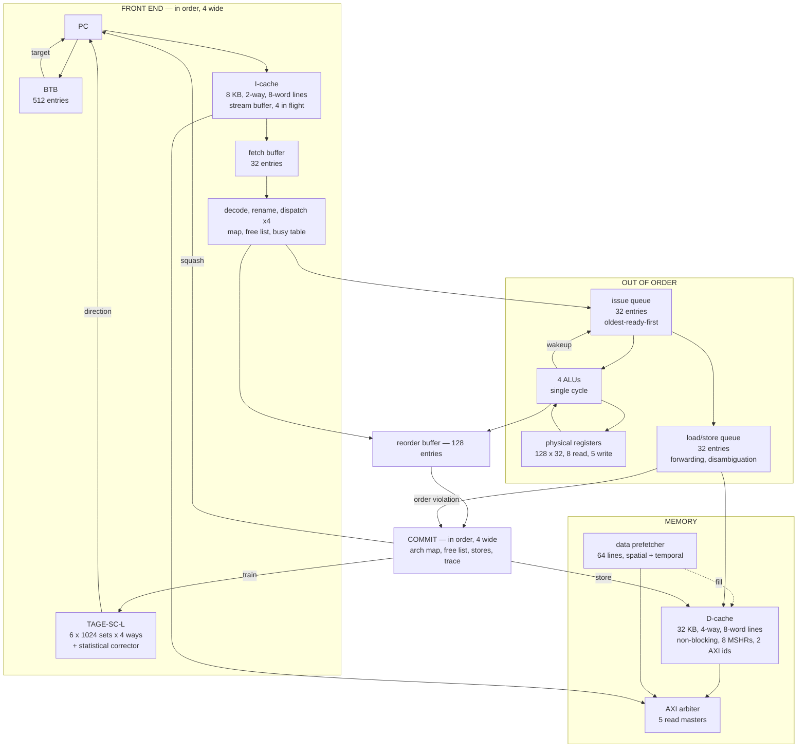

# Advanced-CPU-Optimization

A 4-wide superscalar out-of-order MIPS32 core, replacing a classic 5-stage in-order pipeline.
**Geometric mean 4.27× over the in-order baseline**, trace-verified on four benchmarks.

Every number here was measured on this repository. Correctness bar: `verilator_main.cpp` diffs
every committed pc, writeback and load/store event against the golden traces in `hexfiles/` and
aborts on the first mismatch.

## Results

| benchmark | in-order | final | speedup | IPC (ceiling 4.0) | branch accuracy |
| --- | --- | --- | --- | --- | --- |
| nqueens   |  1,722,402 |    **527,256** | 3.27× | 1.93 | 80.44% |
| quickSort |  9,572,553 |  **2,154,366** | 4.44× | 1.90 | 87.63% |
| esift2    | 21,375,975 |  **2,615,127** | 8.17× | 3.00 | 98.53% |
| coin      | 35,944,392 | **12,836,687** | 2.80× | 2.79 | 99.07% |

Instruction counts match the baseline exactly. esift2 and coin sit at 75% and 70% of the 4-wide
ceiling; nqueens and quickSort are bounded by misprediction alone — quickSort dispatches 5,508,199
instructions to commit 4,103,867, so 25% of all work is wrong-path, against memory under 8%.

### What each change was worth

Cumulative, in the order they were built:

| | nqueens | quickSort | esift2 | coin |
| --- | --- | --- | --- | --- |
| in-order baseline | 1,722,402 | 9,572,553 | 21,375,975 | 35,944,392 |
| + OoO core, 8 KB I / 16 KB D caches | 890,370 | 5,492,808 | 5,814,714 | 34,162,087 |
| + BTB (predict in fetch) | 860,124 | 5,273,026 | 4,834,598 | 28,492,663 |
| + pipelined D-cache port | 807,349 | 5,239,953 | 4,834,598 | 27,294,122 |
| + non-blocking D-cache | 764,041 | 4,528,689 | 4,835,486 | 26,211,879 |
| + memory dependence speculation | 763,961 | 4,235,844 | 4,835,486 | 26,212,489 |
| + window sizing (PRF/ROB 128, LSQ 32) | 763,332 | 3,495,796 | 4,835,133 | 25,207,827 |
| + fetch wider than decode | 757,970 | 3,400,154 | 4,557,362 | 21,405,644 |
| + 3-wide, 8-word I-lines | 618,655 | 2,910,430 | 3,294,956 | 17,160,099 |
| + TAGE-SC-L | 587,259 | 2,863,656 | 3,296,264 | 16,429,702 |
| + 4-wide | 535,271 | 2,741,565 | 2,696,938 | 12,838,826 |
| + 32 KB D-cache, 8-word lines | — | 2,469,870 | — | — |
| + data prefetcher | **527,256** | **2,154,366** | **2,615,127** | **12,836,687** |

Nearly disjoint in what they fix: esift2's entire early gain is the BTB, quickSort's is both memory
changes and neither front-end one.

---

## Architecture



Everything between dispatch and writeback runs out of order, bounded by the issue queue and the
reorder buffer. The front end, rename and commit are all in program order.

Sizing, all in `mips_core_pkg.sv`:

| | |
| --- | --- |
| front end | `FETCH_WIDTH` 8 words in, `FE_WIDTH` 4 instructions out |
| issue | `ISSUE_WIDTH` 4 — 4 ALUs, 8 PRF read ports, 5 write ports |
| window | ROB 128, issue queue 32, LSQ 32, 128 physical registers |
| prediction | TAGE-SC-L: 6 tagged tables × 1024 sets × 4 ways over two path histories, plus a statistical corrector (~90 KB) |
| BTB | 512 entries |
| I-cache | 8 KB, 2-way, 8-word lines, next-line stream buffer |
| D-cache | 32 KB, 4-way, 8-word lines, non-blocking, 8 MSHRs over two AXI read ids |
| D-prefetcher | 64 lines, 16 stream detectors, spatial + temporal, own AXI id |

**All architectural state changes at commit** — register map, physical register freeing, stores
reaching the cache, and the simulation event stream. A squashed instruction is never observable.

The baseline it replaces is the classic five-stage in-order pipeline with a forwarding unit, hazard
controller, split I/D caches and an AXI arbiter:


That RTL is still in the tree (`fetch_unit.sv`, `forward_unit.sv`, `hazard_controller.sv`,
`pipeline_registers.sv`, `reg_file.sv`, `branch_controller.sv`) but is not built;
`mips_cpu/verilator_files` selects the OoO core.

| File | Role |
| --- | --- |
| `ooo/frontend.sv` | Fetch, prediction, fetch buffer, decode, delay-slot-aware redirect |
| `ooo/btb.sv` | Branch target buffer |
| `ooo/rename_rob.sv` | Register map, free list, busy table, ROB, commit, recovery |
| `ooo/issue_queue.sv` | Wakeup and oldest-first select |
| `ooo/lsq.sv` | Disambiguation, store-to-load forwarding, violation detection, D-cache port |
| `ooo/prf.sv` | Unified physical register file |
| `ooo/ooo_backend.sv` | Back-end glue and execution units |
| `branch_predictor_files/tage_m1.sv` | **The predictor in use** — Firestorm-shaped TAGE |
| `branch_predictor_files/statistical_corrector.sv` | The SC of TAGE-SC-L |
| `branch_predictor_files/tournament_predictor.sv` | Perceptron + gshare + chooser; baseline, not wired in |
| `branch_predictor_files/tage_predictor.sv` | Textbook TAGE on direction history, for comparison |
| `d_cache.sv`, `d_prefetcher.sv`, `stream_buffer.sv` | Non-blocking cache, data prefetcher, I-side prefetcher |
| `asic/` | RTL-to-GDS flow (LibreLane/sky130) — see [asic/README.md](asic/README.md) |

---

## Branch prediction

**TAGE-SC-L.** A tagged path-history TAGE shaped after Apple Firestorm
([Yavarzadeh et al](https://arxiv.org/html/2411.13900v1)), with a perceptron-style statistical
corrector on top. Three predictors were built and compared at a matched 64 KB.

Three departures from textbook TAGE ([Seznec and Michaud](https://jilp.org/vol8/v8paper1.pdf)):

- **Path history, not direction** — folds *addresses*, so it records which branches ran and where
  they went, not only which way they fell.
- **Two history registers**: `PHRT = (PHRT << 1) ^ T[31:2]` (target, 100 bits) and
  `PHRB = (PHRB << 1) ^ B[5:2]` (branch, 28 bits).
- **Six tables, 4-way**, 1024 sets, PHRT lengths 100/57/32/18/11/6, PHRB 28/28/28/18/11/6. Each way:
  13-bit tag, 3-bit counter, 2-bit usefulness, valid bit, over a 2048-entry bimodal base.

**Recovery is the expensive part.** A direction history is a pure shift, so undoing *k* branches is
a right shift; a path history is `(PHR << 1) ^ A`, not invertible without `A`. Both registers are
checkpointed into a 256-entry file indexed by the branch's sequence number, and recovery restores
the checkpoint and re-applies the resolved target.

### Why a corrector rather than a bigger TAGE

Splitting nqueens' mispredictions by cause:

| | count |
| --- | --- |
| a tagged entry matched and was wrong | **36,535** |
| no tagged entry matched at all | 2,198 |

94% are a table matching and giving the wrong answer; more tables and longer histories attack only
the second row. A tagged predictor answers from the longest matching context and commits — right
when the context *determines* the outcome, confidently wrong when it merely *correlates*. A
perceptron matches no context: it sums many weak correlations and takes the sign. At a matched 64 KB
on nqueens: tournament 76.9%, TAGE-M1 alone 76.3%, **both together 80.6%**.

The corrector sums signed counters from three families — **bias** on pc, on pc + TAGE prediction,
and on pc + prediction + confidence; **path** GEHL banks over the same two path registers; **local**
GEHL banks over each branch's own outcomes — and overrides only when the magnitude clears an
adaptive threshold. Bias indexed by the TAGE's own prediction learns *the systematic error of the
tagged predictor*, which is the only thing worth a second opinion.

**Local history is the family TAGE structurally cannot have**: TAGE indexes by global path, so a
branch whose own outcomes are regular while its global context never repeats is invisible to it.
Worth 2.8 points on nqueens (a backtracking search), a rounding error elsewhere.

### Predictor comparison

Trace-verified on all four benchmarks. First three held to 64 KB, the last ~90.6 KB.
Cycle counts are 3-wide; the comparison is what the table is for.

| benchmark | tournament | TAGE | TAGE-M1 | TAGE-M1 + SC |
| --- | --- | --- | --- | --- |
| nqueens   |    613,396 / 76.88% |    635,432 / 73.40% |    617,156 / 76.26% | **587,259 / 80.58%** |
| quickSort |  2,916,578 / 86.63% |  2,874,266 / 87.00% |  2,865,268 / 87.32% | **2,863,656 / 87.61%** |
| esift2    |  3,296,052 / 98.53% |  3,306,491 / 98.42% |  3,299,695 / 98.49% |   3,296,264 / 98.53% |
| coin      | 17,157,529 / 98.04% | 16,838,092 / 98.50% | 16,468,716 / 98.82% | **16,429,702 / 99.07%** |

1.027× geometric mean over tournament, of which the corrector is 1.013×. Going 4-wide later moved
nqueens 80.58% → 80.44% — a wider front end predicts from history that has had less time to settle.

The tournament baseline is a perceptron
([Jimenez and Lin](https://www.cs.utexas.edu/~lin/papers/hpca01.pdf)) and a gshare running in
parallel behind a per-pc chooser — 1024 perceptrons × 17 weights of 8 bits, 16 bits of global
history, a 1024-entry gshare table and a 1024-entry chooser:


Its components (tournament / perceptron alone / gshare): nqueens 76.3 / 77.3 / 66.9, quickSort
86.7 / 86.6 / 83.5, esift2 98.6 / 98.6 / 98.3. The chooser is a near-wash; gshare is the weaker half
throughout.

### Two implementation defects worth recording

**The corrector was a net loss until the sum was carried rather than recomputed.** Recomputing at
commit from the checkpointed path history recovers the right indices, but the *contents* are
whatever every branch since trained into them — so the perceptron rule and the adaptive threshold
both learned from a number the machine never acted on. Net effect on coin: **−16,186** recomputed
against **+17,703** carried. Carrying it in a file indexed by the branch's sequence number also
deletes the commit-side sum entirely.

**TAGE allocated into tables that never predict.** 26% of nqueens' allocations went to table 0 —
100 bits of path history, which provides zero predictions all run — because allocation was uniform
among all longer tables rather than into the *nearest* longer one with a decaying skip probability.
Fixed: 617,156 → 612,957 cycles, table-0 allocations 9,928 → 596, accuracy +0.1 points.

### Predicting in fetch, not decode

Predicting in **decode** recognises a taken branch one cycle late, so the sequential instructions
behind it are already in the fetch buffer and the redirect flushes it. On coin that was 21% of all
cycles — 7,224,093 fetch-starved cycles against 7,181,552 conditional branches, **1.006 per branch**.

A 512-entry BTB probed with the fetch address, in parallel with the I-cache access for that address,
answers *is this a branch* and *where does it go* from the pc alone, so nothing on the wrong path is
ever fetched. Three details:

- **Filled from decode**, the first place the answer is known. Direct branch and jump targets are a
  fixed function of the pc, so an entry never goes stale. The tag is every pc bit above the index.
- **Decode still checks fetch's work.** Each buffer entry records where fetch went after it; decode
  redirects only when that differs from where it should have gone. One comparison covers a miss, a
  stale target and a cold branch.
- **`jr`/`jalr` never allocate** — their target is in a register, so fetch could not check it.

On coin: fetch-starved 7,224,093 → **148,004**, **one** decode redirect in 35.8 M instructions,
cycles 34,162,087 → 28,492,663 (**1.20×**).

Two indexing details that cost accuracy if reversed: the **perceptron is indexed by pc alone** (the
history is what the weights are dotted against, so folding it in scatters a branch's weights across
rows), and **gshare is indexed by pc XOR history**.

**Training happens at commit.** A prediction and its outcome are an arbitrary number of cycles apart
and the tables move in between, so the predictor hands back every piece of state it used; that rides
the ROB and returns in program order on the correct path. Global history advances speculatively at
predict time so closely spaced branches see each other, and rewinds from the history the offending
branch carried.

---

## Register renaming

MIPS R10000 structure: register map, free list, busy table, ROB as the active list.


Physical register 0 is never allocated and reads as a hard zero; the decoder clears `uses_r*` for
architectural zero, so every unused operand renames to that tag and needs no special case.

**Misprediction recovery walks the ROB rather than keeping a branch stack.** Squashed entries are
walked youngest to oldest, restoring each one's previous mapping. Because younger entries go first,
the oldest write to any architectural register lands last and wins — exactly the mapping live when
the branch issued. The free list rolls back by the number of squashed destinations. One cycle, no
snapshot storage.

---

## Out-of-order execution

**Wakeup needs no CAM.** The PRF is written at the end of the execute cycle and read
asynchronously, so a result produced in cycle N is readable in N+1 and the busy table clears on the
same edge. Readiness is a combinational look at two busy bits; dependent instructions still issue
back to back. **Select is oldest-first**, age being the distance from an entry's ROB index to the
head — correct across wraps, no age matrix.

**Delay slots.** MIPS runs the instruction after a branch either way, which forces two rules: the
front end will not redirect until the delay slot is accepted (otherwise the target is held pending
for one cycle), and **a branch may not issue until its delay slot has dispatched**, so recovery can
squash everything from the branch's index + 2.

**Memory ordering.** Stores never touch the cache speculatively — address and data are computed at
issue, written at retire. A load matching an older store in the queue forwards from it, youngest
matching store winning, and may issue ahead of an older store whose address is unknown (below).

**The D-cache port is pipelined.** The cache addresses its SRAM from `addr_next` and compares tags
against `addr`, a cycle apart, so it can accept an address every cycle. The original
`M_IDLE → M_LOAD → M_IDLE` walk made even a *hit* hold the port for two cycles, capping throughput
at 0.5/cycle; a one-deep pipeline register doubles it. An access then gets one of three answers, and
only the third keeps the port: `dc_out.valid` (hit), `dc_miss_pending` (an MSHR took the fill; the
entry is marked waiting and `dc_fill_valid` later replays it), or neither (retry). **Waiting lives
in the queue entry, not on the port**, which is what allows several outstanding loads.

### Memory dependence speculation

The conservative rule — a load waits for every older store's address — is correct by construction and
cheap, except when there is nothing else to run. Counting cycles where *nothing at all* is ready
**and** a load is held only by this rule:

| benchmark | load held by the rule | *and nothing else ready* |
| --- | --- | --- |
| quickSort | 991,094 (21.9%) | **854,588 (18.9%)** |
| coin      | 1,576,494 (6.0%) | **0** |
| nqueens   | 43,334 (5.7%) | **0** |
| esift2    | 3,131 (0.1%) | 3 |

The second column is the whole story: coin holds a load 6% of the time and it never costs a cycle.

Loads therefore issue past unresolved stores, and the store checks when it resolves — scanning for
younger loads that already have an address and hit the same word, oldest offender winning. A load
that forwarded from a store *younger* than the one resolving already holds the right value, so each
load records what it forwarded from and those are not violations. **The violation signal is
registered before leaving the queue**: the squash reaches the issue queue that produced the store
issue that detected it, so a combinational path would close a loop.

**Recovery anchors differently from a branch.** A branch survives its own recovery; a violating load
must die, its physical register already holding the wrong value, so recovery re-fetches from the
load's pc — except a load in a delay slot has no reachable pc, so the squash anchors on the
**branch**. Under stress on nqueens, **20 of 42** violations took that path. **The brake** is one bit
per load pc (1024 entries), set when caught and read at dispatch, cleared every 65,536 cycles so an
ended phase does not disable a load forever.

| benchmark | conservative | speculative | gain | speculative loads | violations |
| --- | --- | --- | --- | --- | --- |
| quickSort | 4,528,689  | **4,235,844**  | **1.069×** | 22,990 | 0 |
| nqueens   | 764,041    | 763,961        | 1.000×     | 87     | 0 |
| esift2    | 4,835,486  | 4,835,486      | 1.000×     | 1      | 1 |
| coin      | 26,211,879 | 26,212,489     | 1.000×     | 45,309 | 0 |

A one-benchmark change, exactly as the idle-cycle count predicted. On coin 45,309 loads issue
speculatively for a net 610 cycles in 26 M, because unblocking them only queues them behind an issue
width that was already full.

**Testing a path that never runs.** `-DMDP_STRESS` drops the address comparison, so every store
resolving behind an issued load reports a violation. Traces still match: nqueens 42 violations (20
delay-slot anchored), quickSort 162, esift2 1. Under that rate the predictor learns to stop
speculating — quickSort's 22,990 speculative loads collapse to 493 and the cycle count returns to
its conservative baseline. The mechanism degrades to its own baseline rather than below it.

---

## Non-blocking data cache

The original cache ran one miss at a time: a miss took the whole cache into a refill state machine
and every later access, including hits, waited out the full latency. On quickSort that was **22,179
misses at 112 cycles each, 47% of the run, none overlapping**.

**Miss status holding registers** (Kroft, 1981) each record one in-flight fill — address and target
way, nothing else. On a miss the cache allocates one and answers *pending*, so the next cycle can
serve a hit or take another miss. Three things make it tractable:

- **Replies need no matching.** Reads on one AXI id return in order, so the registers are a FIFO.
- **A second access to a line already in flight merges** into the existing register and shares its
  request. On quickSort 41,550 of 63,729 parked accesses (65%) are merges.
- **Dirty evictions are decoupled** — the victim is copied to a writeback queue in the same cycle
  the miss is taken and the way invalidated immediately.

Two rules must be enforced by hand. **Writebacks can be overtaken** (the model delays writes 120
cycles and reads 100), so an access whose line is in the writeback queue is refused until the
writeback is acknowledged. **A way a fill is aimed at cannot be picked again**, or two fills land in
one way — with 4 ways and 4 registers this can leave no legal victim, which happened **twice** in all
of quickSort.

| benchmark | blocking | non-blocking | gain |
| --- | --- | --- | --- |
| quickSort | 5,240,726  | **4,528,689**  | **1.157×** |
| nqueens   | 807,339    | **764,041**    | 1.057× |
| coin      | 27,294,090 | **26,211,879** | 1.041× |
| esift2    | 4,834,600  | 4,835,486      | 0.9998× |

Not only about misses: nqueens takes 96 D-cache misses in its whole run and still gains 5.7%, coin
takes 29 and gains 4.1%. That part is port discipline — a miss no longer stalls, so the queue stops
gating all memory issue on the port being free (coin's `rename_stall` 3,225,107 → 2,104,286).

On quickSort: a fill outstanding 41.6% of cycles, two or more 11.2%, a load parked 40.4%, registers
full **0**. Those 22,179 fills carry 2.48 M cycles of latency and now fit in a 1.88 M cycle window,
with the core retiring throughout.

---

## Caches and prefetching

The caches were worth more than the entire out-of-order back end:

| change | benchmark | before | after | gain |
| --- | --- | --- | --- | --- |
| I-cache 2 → 8 KB | nqueens | 1,609,772 | 890,282 | **1.81×** |
| D-cache 2 → 8 KB | quickSort | 7,740,489 | 6,233,906 | 1.24× |
| | esift2 | 17,254,324 | 14,431,835 | 1.20× |
| D 2-way 8 KB → 4-way 16 KB, true LRU | quickSort | 6,233,906 | 5,492,808 | 1.13× |
| | esift2 | 14,431,835 | **5,814,714** | **2.48×** |

esift2's D-cache miss cycles fall 9,754,499 → 85,357 (**114×**); nqueens' I-cache miss cycles
742,759 → 16,807. Both crossed a working-set cliff rather than improving gradually. Replacement had
to change with associativity — one `lru_rp` bit is exact LRU for two ways and meaningless for four,
so it is now a per-set recency permutation with invalid ways preferred.

A Jouppi-style **stream buffer** sits beside the I-cache on its own read id, keeping a window of
consecutive lines ahead of the pc with up to four requests in flight — a single outstanding request
would put it only one line ahead, which is no cover against a hundred-cycle miss. A restart bumps a
generation counter and replies whose generation no longer matches are dropped on arrival.


**Eight-word instruction lines** at the same 8 KB (2 ways × 128 sets) went the *opposite* way to
intuition: halving the set count should cost hit rate, but nqueens' I-cache misses fell 16,814 →
9,653, because fetch is sequential enough that a longer line fetches the next words for free. **The
same trade on the data side lost badly** — the two sides do not behave alike.

**The data prefetcher was a dead end until the cache stopped blocking.** The original stride version
was worth 0.065% on quickSort, *negative* on nqueens, and issued 13 prefetches across all of coin —
yet the miss addresses were highly predictable throughout (51.3% same-delta on quickSort, 99.5% on
esift2). **Prediction was never what failed; absorption was.** With a blocking cache and four
registers on one id, a prefetch could only take a resource a demand miss was about to need.

Rebuilt as a structure off to the side with its own storage, AXI id and port, never competing for a
miss register: asked about a line only when the cache takes a demand miss, handing the whole line
over in one cycle, never installing into the cache or probing its tags. Two engines feed one queue —
**spatial** (streams matched by nearness, since the cache is never told which instruction missed)
and **temporal** (which line missed after which).

| | before | after | prefetch hit rate |
| --- | --- | --- | --- |
| quickSort | 2,469,870 | **2,154,366** (1.146×) | 69% |
| esift2    | 2,655,842 | **2,615,127** (1.016×) | **99.2%** |
| nqueens   |   531,470 |   **527,256** (1.008×) | 84% |

The first working version was worth 0.15%, and the counters said why: a confident stream detected
**7,806 times** had issued **146 requests**. There was no replacement policy — a slot is released
only when a demand miss takes its line, so an unwanted prefetch holds one forever. esift2 hid it
completely at a 99.2% hit rate. A round-robin victim took quickSort's `pf_hit` from 41 to 5,527.

---

## Sizing the window

**Attribute the stall before scaling anything.** Every dispatch stall, attributed to the resource
that ran out:

| benchmark | dispatch stalls | free list | ROB | issue queue | LSQ |
| --- | --- | --- | --- | --- | --- |
| quickSort | 1,251,515 (29.5%) | **100%** | 0 | 0 | 0 |
| coin      | 2,105,508 (8.0%)  | ~0 | ~0 | 0 | **99.98%** |
| esift2    | 93,576 (1.9%)     | 0  | 0  | 0 | **100%** |
| nqueens   | 10,713 (1.4%)     | 17% | 0 | 0 | 84% |

The ROB and issue queue were never the constraint, for an arithmetic reason: the free list holds
`PHYS_REGS - ARCH_REGS` tags, so at 64 physical registers only 32 register-writing instructions can
be in flight against a 64-entry ROB — it physically could not fill.

| quickSort | cycles | |
| --- | --- | --- |
| PRF 64, ROB 64, LSQ 16 | 4,235,844 | |
| LSQ 32 alone | 4,235,844 | identical to the cycle |
| **PRF 128 alone** | **3,890,402** | **1.089×** |
| + ROB 128 | 3,540,153 | 1.099× |
| + LSQ 32 | **3,495,796** | 1.013× |

`LSQ_ENTRIES` measured **exactly zero** at ROB 64 and is worth 44,357 cycles at ROB 128 — visible
only once the structure in front stops binding. On **coin** it is worth 1.04× alone, its dispatch
stalls having been 99.98% LSQ all along; that nearly went unnoticed because the isolating runs were
done on the three fast benchmarks. **A parameter sweep that skips the slow benchmark is not a sweep.**

`ROB_ENTRIES` 128 needs no RTL change, only `--unroll-count 512 --unroll-stmts 100000`: the five
Verilator errors at 128 are all `BLKLOOPINIT` on nonblocking assignment to an unpacked array element
inside a `for` loop, which Verilator accepts only when it can fully unroll.

### Feeding the front end

Splitting no-issue cycles by cause showed *nothing ready* was the largest loss — 5.85 M cycles
across the suite against 695 k of empty window. Occupancy separates two problems sharing that name:
on quickSort the window holds ≥16 entries 69% of the time it is stuck (a deep window waiting on
memory), while on coin and esift2 it **never reaches 16 at all**. A shallow window with nothing
ready means instructions were not arriving:

| | offers 0 | offers 1 | offers 2 | mean | actual IPC |
| --- | --- | --- | --- | --- | --- |
| coin   | 1.2% | **49.0%** | 49.8% | 1.487 | **1.419** |
| esift2 | 0.8% | **30.2%** | 69.0% | 1.681 | **1.625** |

coin's front end offered a single instruction on half of all cycles, and its IPC was within 5% of
its delivery rate. Two near-equal causes: the pair straddling the end of a 4-word line (45.0%) and
the delay slot of a taken branch falling outside the pair (53.8%) — **7,008,269 short fetches
against 7,181,543 conditional branches, 0.98 per branch.**

Neither empties the buffer, which is why `fetch_starved` never saw them. **A completely empty fetch
buffer is rare; a half-empty one was the common case and cost just as much.** Decoupling fetch width
from decode width fixed both: a line-aligned fetch never crosses a line end, and the delay-slot case
narrows to a branch in the *last* word of the group.

| benchmark | before | after | gain | IPC |
| --- | --- | --- | --- | --- |
| **coin**  | 25,207,827 | **21,405,644** | **1.178×** | 1.419 → **1.671** |
| esift2    | 4,835,133  | **4,557,362**  | 1.061× | 1.625 → **1.724** |
| quickSort | 3,495,796  | **3,400,154**  | 1.028× | 1.174 → 1.207 |
| nqueens   | 763,332    | **757,970**    | 1.007× | 1.330 → 1.339 |

Without touching an execution resource, coin's "window holds work but nothing is ready" went from
5,191,260 cycles to **1,571**. That 20.6% reads like dependence chains and would ordinarily be
answered with a deeper window; it was entirely an artefact of a window that could not accumulate at
1.42 arrivals per cycle.

### Widening

Both widths are single parameters — ALUs, register file ports and writeback ports are generate loops
over `ISSUE_WIDTH`; decode, rename, dispatch and commit loop over `FE_WIDTH` — so they were measured
separately, which mattered:

| benchmark | 2-wide | `ISSUE_WIDTH` 3 only | + `FE_WIDTH` 3 |
| --- | --- | --- | --- |
| nqueens   | 757,970    | 720,143 (1.053×)    | **647,872** (1.112×) |
| quickSort | 3,400,154  | 3,331,071 (1.021×)  | **3,050,477** (1.092×) |
| esift2    | 4,557,362  | 4,521,289 (1.008×)  | **3,333,506** (1.356×) |
| coin      | 21,405,644 | 21,405,604 (**1.000×**) | **17,682,190** (1.211×) |

A third issue slot alone bought coin **40 cycles**, because dispatch and commit still capped it at
two. **A wider issue stage is worth nothing without a wider front end to feed it and a wider commit
to drain it.** 4-wide was then worth 1.280× on coin and 1.222× on esift2 — the largest single win in
the project — and esift2's free-list stall (447,156 cycles, 100% of its dispatch stalls at 3-wide)
went to **zero**, because instructions retire fast enough to recycle their own tags.

### What a squash costs

`squash_refill` counts cycles between a redirect and rename getting an instruction again:
nqueens 1.14 per squash, quickSort 1.04, esift2 1.04. **The front end recovers from a redirect in
about one cycle**, so the entire cost of a misprediction is wrong-path work already dispatched, and
shortening the redirect path would gain nothing.

quickSort's remaining ceiling is not structural: the front end offers 2.716 instructions per cycle
and a full four on only 40% of cycles (`fe_line_edge` fires 1,278,852 times — a fetch starting
mid-line gets only the words to the end of it). Even perfect prediction leaves it near 2.7 IPC.

---

## Negative results

Four measurements that reversed an earlier conclusion or refuted an obvious one. They are the most
useful part of this file.

**Relieving a full structure buys nothing without independent work behind it.** Three instances:

| | stall relieved | worth |
| --- | --- | --- |
| coin `LSQ_ENTRIES` 32 → 64 | `stall_only_lsq` 3,415,793 → 0 (26.6% of its run) | **10 cycles** |
| quickSort second AXI id, `NUM_MSHR` 8 | `Dmiss_regs_full` 205,478 → 0, refusals 12,581 → 14 | **0.15%** |
| ROB + PRF to 256 | `stall_only_rob` 234,022 → 1,463 | 1.021× on quickSort, others identical to the cycle |

Each time the backlog moved one structure along — coin's `stall_only_iq` rose 195,795 → 3,593,966.
`Dmiss_inflight` barely moved because quickSort's misses are *dependent*, already overlapping as far
as the program allows. **The counter tells you where the queue ends, not why.** `stall_preg` and
`stall_rob` were causal, worth 1.089× and 1.099×; coin's `stall_lsq` never was. This mistake was
made three times, twice after being written down.

**An occupancy counter is an upper bound set by whatever is upstream.** "3+ instructions ready on
only 8.8% of coin's cycles, so 4-wide is not worth building" was measured against a 64-entry ROB
behind a 2-wide front end. At ROB 128 with a 3-wide front end the same counter reads **68%** on
esift2. The same error was made about wide fetch, using `fetch_starved` — which only fires when the
buffer is *completely empty*. Twice a window measurement was read as a fact about the *programs*
when it was a fact about the *machine measuring them*.

**Shrinking a cache to pay for a prefetcher loses in both directions.** At 8 KB, with esift2 taking
114× more D-cache misses, the stride prefetcher still recovered 0.002% of its cycles — while the
capacity cliff between 8 and 16 KB costs esift2 **2.50×**, roughly 35,000× what the prefetcher
recovers there.

**An out-of-order core halves the compute half of a workload and does nothing about the memory
half.** At the stock 2 KB caches it reached 1.33× (nqueens) to 1.95× (esift2) on non-memory cycles,
while memory stall cycles were untouched to within one cycle, because both caches were blocking.
What each benchmark gains depends entirely on its mix.

---

## Simulation

Verilator from [oss-cad-suite](https://github.com/YosysHQ/oss-cad-suite-build);
`mips_cpu/Makefile` expects `$CSE148_TOOLS` to point at the directory containing it.

```
cd hexfiles && for f in *.bz2; do bunzip2 -kf "$f"; done    # once, before the first run
cd mips_cpu && make verilate
./obj_dir/Vmips_core -b nqueens
```

Benchmarks: `nqueens`, `quickSort`, `esift2`, `coin`. coin is 35.7 M instructions against esift2's
7.9 M and takes correspondingly longer.

Flags: `-b <benchmark>`, `-d` (dump `simx.fst`), `-m` (memory model debug, repeatable), `-s` (skip
stream checks), `-p` (print events). `-DMDP_STRESS` at build time exercises the memory-order
recovery path.

In a container:

```
docker run --rm -v "$PWD:/work" -w /work/mips_cpu <image> bash -lc \
  'source /root/cse148env; source $CSE148_TOOLS/oss-cad-suite/environment; \
   make verilate && ./obj_dir/Vmips_core -b nqueens'
```

If `coin.ls.txt.bz2` fails to decompress the git archive is intact (md5
`ddb5e9b2a81ebcb95dee219cfebedb1b`); `git checkout -- hexfiles/coin.ls.txt.bz2` restores it.

## ASIC flow

`asic/` drives LibreLane/OpenROAD on sky130A — see [asic/README.md](asic/README.md).
Synthesis-only results; no block was taken to GDS.

| design | cells | area |
| --- | --- | --- |
| `cache_bank` | 89 | 1,192 µm² (the SRAM is a macro) |
| `prf` | 45,274 | 581,694 µm² |
| `btb` | 157,227 | 2,289,411 µm² |
| `statistical_corrector` | 795,744 | — (killed entering technology mapping) |

**Storage is a minority of all three; the access network is the rest.** The 128×32 PRF with 8
asynchronous read ports and 5 writes spends 87,123 µm² on flip-flops — 15% — and the other 85% on
the mux network. The BTB holds ~20,000 bits in 2.29 mm², about 112 µm²/bit against 20 µm²/bit for a
raw flop. From the PDK: `dfxtp_1` is 20.0 µm²/bit (50.0 at 40% utilisation),
`sky130_sram_2kbyte_1rw1r_32x512_8` is 17.4 — SRAM wins by ~2.9×, not the 10× intuition suggests,
because OpenRAM carries heavy peripheral overhead.

The predictor tables are flip-flops, which is why `statistical_corrector` is 795,744 cells and why
neither it nor `tage_m1` finishes synthesis in a 6 GB session. In a real design they would be SRAM;
converting them needs a registered read, which the predictor's single-cycle combinational path
cannot currently absorb.
